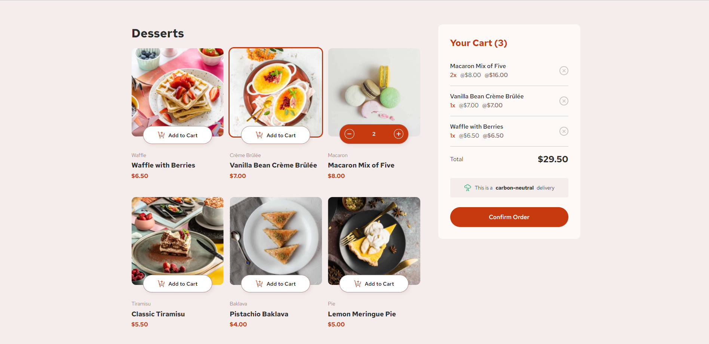
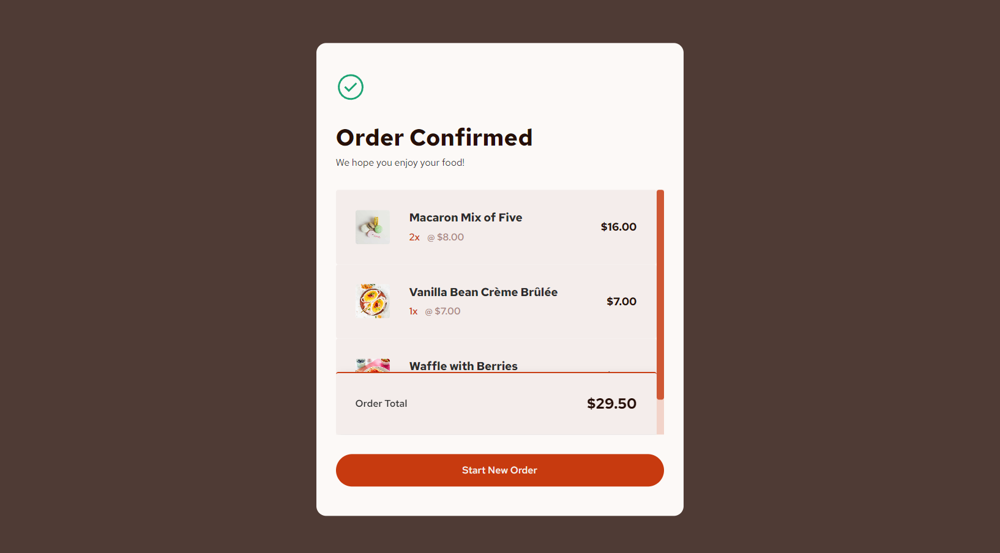
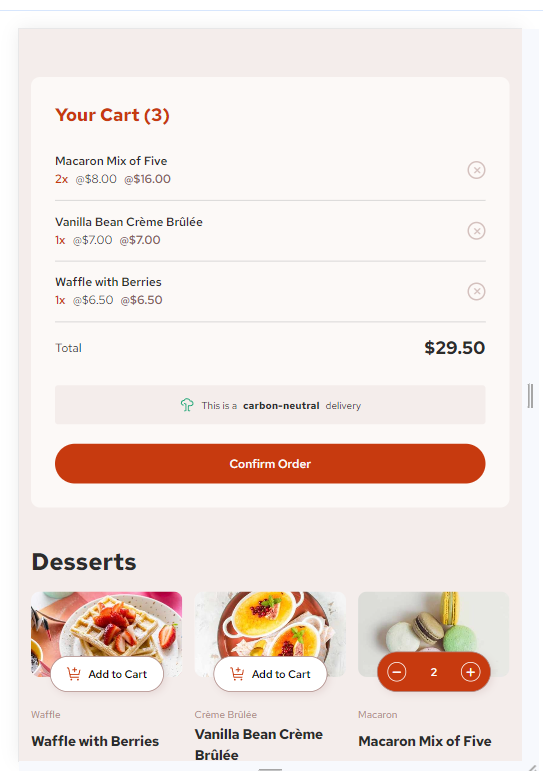
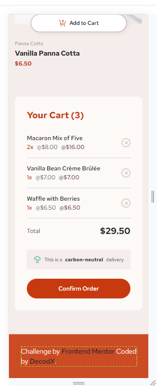

# Frontend Mentor - Product list with cart solution

This is a solution to the [Product list with cart challenge on Frontend Mentor](https://www.frontendmentor.io/challenges/product-list-with-cart-5MmqLVAp_d). Frontend Mentor challenges help you improve your coding skills by building realistic projects.

## Table of contents

- [Overview](#overview)
  - [The challenge](#the-challenge)
  - [Screenshot](#screenshot)
  - [Links](#links)
  - [Built with](#built-with)
  - [What I learned](#what-i-learned)
  - [Continued development](#continued-development)
  - [Useful resources](#useful-resources)
- [Author](#author)

## Overview

I am so happy and feel great after finishing this challenge. Its been tough but i give all my knowledge to finish this.

### The challenge

Users should be able to:

- Add items to the cart and remove them
- Increase/decrease the number of items in the cart
- See an order confirmation modal when they click "Confirm Order"
- Reset their selections when they click "Start New Order"
- View the optimal layout for the interface depending on their device's screen size
- See hover and focus states for all interactive elements on the page

### Screenshot

### Links

- Solution URL: [https://www.frontendmentor.io/solutions/vanilla-javascript-for-interaction-and-modern-css-5lIb8E4oTp
- Live Site URL: [https://product-list-with-cart-2yl2psm71-wildecodxs-projects.vercel.app/

### Built with

- Semantic HTML5 markup
- CSS custom properties
- Flexbox
- CSS Grid
- Responsive Design
- Vanilla Javascript for interactions

### What I learned

This challenge helped me to improve my skills technically in js knowledge.

### Continued development

I just want to enhance more my js knowledge and after i am good with this. I will learn the frameworks. I will prove to myself that i become an full-stack devs. All things are possible with God!

### Useful resources

- [uiverse](https://uiverse.io/) - This helped me for loaders. I really liked this pattern and will use it going forward.
- [fontawesome](https://fontawesome.com/icons) - This is an amazing icons resources which helped me. I'd recommend it to anyone use this site.

## Author

- Frontend Mentor- [@wildecodx](https://www.frontendmentor.io/profile/wildecodx)
- Github - [@wildecodx](https://github.com/wildecodx)
- ICodeThis - [@wildecodx](https://icodethis.com/wildecodx)
